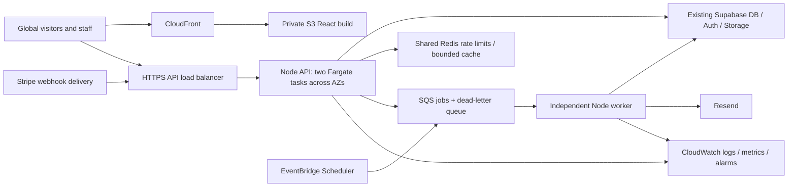

> Packaging update: the owner subsequently requested this standalone `ltc/` repository. Active `frontend/`, `backend/` and `infra/` paths are relative to this directory. Legacy/reference material stays outside it. Historical layout statements below describe the earlier workspace; see [README](README.md) and [AGENTS](AGENTS.md) for current organization.

# LTC implementation plan: Node.js migration and repository cleanup

Date: 7 October 2026  
Status: implementation handoff; application changes have not been made  
Companion documents: [performance.md](performance.md) and [design.md](design.md)

> DATABASE APPROVAL RULE: The existing database is LIVE. Never apply a database migration automatically, including to a test database. The owner will create the test database. Before any schema change, present the exact SQL, target project/database, effects, validation, backup requirements, and rollback/recovery plan; ask the owner for approval and wait for an explicit answer. Approval of this implementation plan, provision of database credentials, or a generic instruction to continue is not approval to apply migrations. An empty or delayed response is not approval.

## 1. Objective and authorization boundary

Transition the existing FastAPI backend to Node.js, retain the existing React public website and admin application, and finish with one repository rooted at `LTC/` containing `frontend/`, `backend/`, and `infra/`. Preserve existing production data and functionality. Prepare a reproducible AWS deployment that the owner can review, test manually, and deploy.

The owner explicitly requires the public website's content and design to remain the same. This is a migration and reliability project, not permission to rebuild every screen or introduce the entire future admin roadmap.

This document authorizes a staged implementation when the owner gives it to an implementing AI with an instruction to execute it. Merely reading this document does not authorize changes. Creating these three planning documents does not authorize application edits, dependency installation, production writes, deletion, or deployment in the current planning session.

When execution is authorized:

- Read the repository's `AGENTS.md` and all three plans before editing. Reconcile outdated path and architecture instructions with the owner's explicit migration request.
- Present the concrete file/dependency manifest before starting. The Node.js backend necessarily needs new files and dependencies; do not repeatedly request authorization for work already explicitly approved, but do flag unapproved scope additions.
- Work in a migration branch. Record the starting commit and existing uncommitted changes; never overwrite unrelated work.
- Work locally and against isolated staging services. Do not send real newsletters, create live payments, alter production accounts, apply production migrations, push, merge, or deploy without explicit authorization for that action.
- Use the owner-created test Supabase project/database. Do not create, reset, seed, migrate, or connect tests to the live database. Confirm the test project identity before any integration test that writes records; mocks need no database. Migration execution on the test database still needs explicit approval for the reviewed SQL and target.
- Preserve public components and JSX. A frontend-wide TypeScript conversion, new UI library, new authentication provider, and database-provider migration are outside this release.
- Remove Python from the final working tree only after the replacement passes the gates in section 13. Preserve recovery through Git and deployment artifacts, not an active legacy directory.

## 2. Verified starting point and uncertainty

| Area | Checked-in implementation | Migration implication |
| --- | --- | --- |
| Frontend | `LTC-frontend/`, React 19, Vite, React Router, Tailwind 3, custom CSS | Move to `frontend/`; preserve public routes, assets, text, composition, and behavior |
| Backend | `LTC-backend/app/`, Python FastAPI | Port route, validation, service, and authorization behavior to Node.js |
| Data/auth/storage | Supabase PostgreSQL, Supabase Auth and Storage | Retain provider and identities for this release |
| Payments | Stripe Checkout, recurring donations, webhook ledger | Preserve all payment protections and reconcile ledger totals |
| Email | Resend; current delivery uses API-process background tasks | Replace delivery with durable jobs and independent worker |
| Redis | Distributed rate limiting | Preserve distributed protection; Redis is not the proposed SQS job queue |
| Hosting | Owner reports Railway Hobby | Obtain actual service settings and failure evidence before attributing outages |
| Deployment files | Dockerfiles, Render blueprint, Vercel configuration, backend GitHub CI | These are repository evidence, not proof of the active Railway configuration |
| Django | No tracked active Django application found | Correct obsolete documentation/comments; do not invent files to delete |

Confirmed audit observations:

1. `LTC-backend/migrations/db.sql` does not include current permissions/audit tables and required RPCs despite its documentation describing a complete bootstrap. Its user constraints also omit newer roles/states.
2. `render.yaml` and newsletter documentation invoke `python -m app.worker`, but that module does not exist; the current API uses `BackgroundTasks` for email delivery.
3. `dashboard/service.py` performs 20 separate count queries per summary and creates an eight-thread pool for each request.
4. Mocked-response reproductions using the existing frontend API client demonstrated concurrent refresh attempts clearing a valid session and an older GET repopulating stale cache after a mutation.
5. The frontend client has no default request timeout. No route error boundary was found in the reviewed application tree.
6. Admin donation totals are calculated from a limited page of requested session amounts rather than the complete payment ledger.
7. User-detail routes redirect to the list despite a detail component existing. Subscriber management and newsletter scheduling are incomplete surfaces.
8. CSS declarations in `src/shared/styles/index.css` override some declarations from `globals.css`; preserve the actual rendered baseline before consolidating them.

All relative frontend JavaScript imports resolved in the audit, and Python source parsed without syntax errors. Builds, linting, and backend tests could not execute because local dependencies were absent. No live Railway incident, browser performance baseline, or complete production database schema was verified. These limitations must not be reported as passing tests or established outage causes.

## 3. Target repository

`LTC/` denotes the repository root. Do not create `LTC/LTC/`. Renaming the checkout or GitHub repository is optional and separate from changing application paths.

```text
LTC/
├── frontend/
│   ├── src/{app,site,admin,auth,portal,shared,services}/
│   ├── public/
│   ├── docs/
│   ├── package.json
│   ├── package-lock.json
│   └── .env.example
├── backend/
│   ├── src/
│   │   ├── app.ts                 HTTP application factory, importable in tests
│   │   ├── server.ts              Process startup, listening, graceful shutdown
│   │   ├── config/
│   │   ├── middleware/
│   │   ├── shared/                Provider adapters, errors, logging, uploads
│   │   ├── modules/               Existing business domains
│   │   ├── workers/               Separate worker entrypoint and processors
│   │   └── jobs/                  Scheduled invitation cleanup and dispatch
│   ├── migrations/               Existing SQL history and verified bootstrap
│   ├── tests/
│   ├── scripts/
│   ├── docs/
│   ├── package.json
│   ├── package-lock.json
│   ├── tsconfig.json
│   └── .env.example
├── infra/
│   ├── aws/                      AWS CDK v2 in TypeScript
│   ├── docker/                   API/worker image definition and ignore rules
│   ├── docs/                     Deployment, rollback, recovery, cost checklist
│   ├── package.json
│   └── package-lock.json
├── .github/workflows/            Required location for GitHub discovery
├── .gitignore
├── AGENTS.md
├── README.md
├── implementation.md
├── performance.md
└── design.md
```

Keep only directories that contain implemented functionality. Preserve `LTC-docs/` organizational material: review with the owner before relocating or deleting it; it is not Python cleanup. Retain repository metadata and unrelated documents. The three application directories do not require deleting other legitimate root material.

During implementation, retain `LTC-backend/` as the temporary reference while `backend/` is built. Rename `LTC-frontend/` to `frontend/` in an isolated structural commit. Update relative documentation links, CI paths, build contexts, and environment discovery. Moving a directory alone should not change its internal relative imports.

## 4. Technology and dependency decisions

Use one supported Node.js LTS release; check support at implementation time and pin the exact version consistently in development, CI, and container builds. Use TypeScript for the new backend and infrastructure; leave existing React JSX intact. Use npm lockfiles and reproducible `npm ci` builds.

Proposed minimal backend dependency manifest, to present before execution:

| Purpose | Proposed choice | Constraint |
| --- | --- | --- |
| HTTP | Express 5 | Central error handler; explicit validation and limits |
| Input/config validation | Zod | Preserve Pydantic semantics, including multipart coercion |
| Supabase | `@supabase/supabase-js` | Service-role key only on server; request-scoped auth clients |
| JWT verification | `jose` | Verify issuer, audience, signing algorithm, expiry, and key rotation |
| Payments | `stripe` | Pin compatible API/SDK behavior; no silent Stripe API-version upgrade |
| Distributed rate limits | `redis` | Preserve atomic counters across API replicas |
| Multipart uploads | `multer` or a justified streaming parser | Bound bytes, files, fields, total request size, and concurrency |
| Durable jobs | `@aws-sdk/client-sqs` | AWS task roles; no static AWS access keys in source |
| Scheduled work | `@aws-sdk/client-scheduler` if needed | Least-privilege scheduler role |
| Email/provider HTTP | Native fetch with deadlines | No extra email SDK required |
| Configuration loading | One environment loader if necessary | Document path behavior after folder moves |
| Tests | Native `node:test` and assertions | Compile TypeScript tests; mock external provider boundaries |
| Infrastructure | `aws-cdk-lib`, `constructs`, TypeScript tooling | Synth/diff locally; deployment belongs to the owner |

Use native structured JSON logging initially unless a logging package has a concrete requirement. Do not add an ORM, Redux, Next.js, MongoDB, a component kit, or a second queue framework for this migration. Frontend dependencies remain locked unless a specific change is approved.

Express 5 forwards rejected promises from async handlers to error middleware; detached workers and callbacks still require their own error handling. See [Express error handling](https://expressjs.com/en/5x/guide/error-handling/).

## 5. Contract inventory and parity requirements

The implementing AI must produce a machine-checkable endpoint inventory from actual router/schema source before porting. Record method, path, authorization, query defaults/limits, content type, input/output fields, success code, error cases, side effects, and frontend callers. Include schemas and example fixtures with synthetic data. Do not copy production secrets or personal records into fixtures.

Preserve these current endpoint families; braces below denote path parameters, not literal Express syntax:

| Domain | Existing routes to preserve |
| --- | --- |
| Auth | POST `/api/auth/login`, `/refresh`, `/forgot-password`, `/set-password`, `/change-password`; GET `/api/auth/me` |
| Dashboard/health | GET `/api/admin/dashboard/`, `/api/health`, `/api/ready`, `/api/admin/metrics` |
| Users | GET `/api/admin/users`, GET/PATCH/DELETE `/api/admin/users/{id}`; POST `/invitations`; POST per-user `/disable`, `/enable`, `/invitation/resend`, `/invitation/revoke`, `/regenerate-password`; PATCH per-user `/role`, `/status` |
| Permissions | GET `/api/admin/permissions`, `/user-authorizations`, `/role-permissions`; PUT `/api/admin/roles/{role}/permissions`; GET/PUT `/api/admin/users/{id}/permissions`; POST per-user `/permissions/reset` |
| Public team profiles | GET `/api/team-profiles`, `/api/team-profiles/published`, `/api/team-profiles/{id}` |
| Admin profiles | GET `/api/admin/team-profiles`; GET/POST/PATCH `/api/admin/my-team-profile`; GET/PATCH/DELETE `/api/admin/team-profiles/{id}`; POST `/api/admin/team-profiles/reorder`; POST per-profile `/publish`, `/unpublish`, `/reject`, `/request-changes` |
| Submission links | GET/POST `/api/admin/profile-submission-links`; POST per-link `/revoke`; GET `/api/profile-submission-links/{token}/validate`; POST `/api/profile-submissions/{token}` and per-token `/image` |
| Stories | GET `/api/stories` and `/api/stories/{id}`; GET/POST `/api/admin/stories`; PATCH/DELETE `/api/admin/stories/{id}` |
| Mentors | POST `/api/mentors/applications/`; GET `/api/admin/mentors/applications`; PATCH `/api/admin/mentors/applications/{id}` |
| Subscribers | POST `/api/subscribe/`; GET `/api/unsubscribe/{token}/`; GET `/api/admin/subscribers/` and `/count/`; PATCH/DELETE `/api/admin/subscribers/{id}/` |
| Newsletters | GET/POST `/api/admin/newsletters/`; PATCH/DELETE per-newsletter `/`; POST per-newsletter `/banner/`, `/attachments/`, `/send/`; DELETE individual attachment; GET `/preview/`, `/status/` |
| Public donations | POST `/api/donations/checkout-session/`; GET `/api/donations/session/{id}/`, `/progress/`, `/supporters/`; GET/POST `/api/donations/pledges/` |
| Admin donations | PATCH `/api/donations/admin/session/{id}/supporter-publication/`; GET `/api/admin/donations`; GET `/api/admin/donations/pledges`; PATCH individual pledge; POST `/api/admin/donations/manual` |
| Stripe | POST `/api/stripe/webhook/` |
| Audit | GET `/api/audit`, `/api/audit/summary`, `/api/audit/{id}` |

The table abbreviates repeated prefixes. Actual source is authoritative; compare the generated inventory so no route disappears. Preserve current React routes, including `/mission` and `/about`, authentication aliases, recovery links, unsubscribe links, donation success, and public profile submission.

Contract rules:

- Keep JSON versus multipart behavior, array versus object responses, nullable fields, timestamps, pagination defaults, and preview HTML/blob responses compatible.
- Preserve existing response field names and human-readable `detail` errors; optional machine-readable error codes may be added without breaking callers.
- Missing/expired credentials are 401, denied access 403, absent records 404, invalid input 422 where the current contract requires it, conflicts 409, oversized uploads 413, rate limits 429 with `Retry-After`, and unavailable dependencies 503.
- Handle preflight/CORS and trailing slashes without redirects for Stripe webhook POSTs. Never turn an API error into the SPA HTML document.
- Keep sorting and public visibility rules stable. Never return draft stories, unpublished profiles, private subscriber data, or unapproved supporters to public endpoints.
- Preserve escaped path tokens and URL query semantics, including auth recovery hash/query handling.
- Validate complete payloads before side effects. Fix established defects explicitly; do not blindly reproduce unsafe behavior.

## 6. Database and authentication migration

Retain the existing Supabase project for production initially. The owner will create and supply a separate test Supabase project/database; development and integration tests use that project only. If the owner creates standalone PostgreSQL rather than Supabase, explain that Auth/Storage and Supabase RPC contracts also need a compatible isolated environment; do not silently switch the architecture. Node.js will eventually call existing production APIs/RPCs only after the owner's deployment. Switching implementation language does not require exporting/recreating user accounts or changing passwords.

Writing migration SQL for review is permitted during an authorized implementation. Executing it is a separate approval-gated action. Never run a migration in application startup, Docker entrypoints, tests, CI, CDK, deploy scripts, or background jobs. No migration tool may execute a reset/drop/bootstrap command by default.

Before requesting approval, prepare a concrete review packet:

- Exact migration filenames, SQL contents/checksums, order, and justification.
- Explicit TEST or PRODUCTION label and the exact target project/database identifier, excluding credentials.
- Expected tables/functions/constraints/data changes, locks, compatibility effects, and any destructive operation.
- Backup/recovery requirements and realistic rollback limitations, plus read-only verification queries.
- The exact execution command or the SQL the owner can run manually.

Wait for approval of that packet and target. Approval for a test target never authorizes the live target. A changed script/checksum or target needs renewed approval. Prefer owner execution for live migrations; production schema changes are outside this implementation by default. Do not pressure the owner to approve an unnecessary migration: first determine whether the existing schema supports the port unchanged.

Suggested approval request: "I prepared [SQL filenames/checksums] for TEST project [identifier]. It will [concrete effects]. Verification and recovery are [references]. May I execute this reviewed SQL against that test project? Your database approval rule requires explicit approval before migrations." While approval or the test database is pending, continue independent code, mocked tests, static SQL review, documentation, and infrastructure synthesis; do not run dependent integration tests or claim their gates passed.

Before schema changes:

1. Inventory SQL source and the approved test schema first. Obtain a sanitized live schema export from the owner, or explicit read-only access approval, before inspecting the live database. Compare tables, constraints, indexes, RPCs, grants, RLS, buckets, and migration state with all SQL history, not just `db.sql`.
2. Identify explicit migration dependencies. Timestamped filenames have overlapping sequence identifiers; do not assume lexical ordering alone guarantees a valid upgrade.
3. Preserve all current IDs, payment references, publication states, consent records, profile links, invitation state, audit history, and auth-user relationships.
4. Prepare a reconciled bootstrap with required RBAC/audit and newer donation/invitation behavior. Validate SQL statically first; test application against the owner-created database only after the owner approves the exact schema setup. Fresh/upgrade migration rehearsals need separate approved isolated targets; never create an upgraded copy containing production personal data without explicit authorization. Some existing RBAC migrations require a previously bootstrapped active super admin; account for that ordering explicitly.
5. Retain the historical SQL files. Record the applied set and checksums in a migration ledger; never automatically reapply history at API startup.
6. Run existing security verification and new read-only schema checks on the approved test target. Live checks/backups need explicit owner authorization or owner execution. Database backups and media-object backups are separate obligations.

Never run both the unreconciled bootstrap and all migrations blindly. Prefer additive, backward-compatible changes while both implementations may need the schema. Introduce database transactions/RPCs for atomic multi-record writes; no partial payment ledger or half-applied permission changes.

Auth and authorization requirements:

- Retain Supabase Auth and the current access/refresh response contract. Authenticate locally against signing keys when supported; validate JWT issuer, audience, algorithm, and expiry.
- Keep app-user active status and effective permissions database-authoritative. Disabled/revoked users must not retain access through a stale cache.
- Use isolated auth clients for login, refresh, recovery, and password changes. Never mutate the service-role singleton's auth session.
- Separate provider/network failure from invalid credentials. A Supabase outage must not become an arbitrary invalid-password response or destructive browser logout.
- Preserve super-admin restrictions, invitation TTL/lifecycle, expiry cleanup, protected-account behavior, and immutable audit identifiers.
- Centralize protected account identity in configuration/stable IDs after reconciling inconsistent hardcoded identities; never expose real account addresses in fixtures or documents.
- Retain Redis distributed rate protection with trusted-proxy configuration matching the actual load balancer. Do not trust client-supplied forwarding headers from arbitrary connections.
- Cookie-based sessions or a move to Cognito is a separate, explicitly scoped migration. Record existing browser token-storage risk; do not change auth transport mid-port without updating/tested frontend contracts.

## 7. Payments, uploads, newsletters, and jobs

### Payments

- Preserve USD/minimum amount semantics and current money representation. Avoid floating-point arithmetic for ledger computation; validate against the current schema and provider units.
- Preserve checkout idempotency keys, session/payment IDs, recurring installments, subscriptions, failures, cancellations, expiration, refund updates, and supporter anonymity/consent.
- Register bounded raw-body webhook handling before general JSON middleware; verify Stripe signatures before storing/processing events. See [Stripe signature and duplicate-event guidance](https://docs.stripe.com/events/manage-webhook-endpoints).
- Deduplicate using database uniqueness and atomic claims. Recover processing leases after crashes. Handle out-of-order events without downgrading a settled record incorrectly.
- Return a successful webhook acknowledgement only after durable acceptance. If queued, persist an inbox/outbox entry with the event and dispatch state; recover a database-success/queue-failure gap. If persistence fails, return an error so Stripe retries.
- Reconcile expected amounts, currency, refunds, installment counts, and aggregate totals. Do not trust the success redirect as proof of payment.
- Keep manual donations restricted and audited. Preserve financial totals independently of list pagination and prevent a donation-view permission from requiring pledge access to render.
- Avoid retaining unnecessary full Stripe payloads or customer data; restrict and expire any retained event payloads. Do not log them.

### Uploads and content

- Preserve accepted formats, per-file limits, attachment aggregate limits, required fields, and storage bucket paths.
- Enforce byte limits while receiving data, not only after building an unbounded memory buffer. Check MIME claims and content signatures. Sanitize names and bound simultaneous uploads.
- Keep credentials server-side. Validate profile link expiry/revocation before submission and upload; preserve submission limits and reusable-link behavior.
- Compensate failed storage/database operations and record orphan cleanup for retry. Never delete a shared asset still referenced elsewhere.
- Sanitize allowed rich HTML on the server for stored stories/newsletter content while preserving intended formatting. Reject executable markup and unsafe URL schemes. Test migrated content before making sanitizer changes live.

### Durable newsletter delivery

Replace API-process delivery with SQS-backed work executed by a separate Node.js process. The API and worker can share one image and use different entrypoints. Keep the current send/status API compatible.

1. Claim a send attempt atomically and freeze its content/audience definition.
2. Persist a job/outbox record before returning 202; dispatch it to SQS, with recovery for dispatch failures. A 202 means durable acceptance, not completed delivery.
3. Page through all active subscribers; do not rely on a provider's default row cap. Freeze or deterministically partition recipients so retries do not change batch membership.
4. Track attempt/batch/recipient results and deterministic provider idempotency keys. Increment progress durably after each batch; distinguish provider acceptance from confirmed delivery.
5. Check current suppression/unsubscribe state immediately before sending. Do not resurrect unsubscribed addresses during imports or retries.
6. Retry transient failures with backoff, provider rate-limit handling, and bounded attempts; route exhausted work to a dead-letter queue with an operator recovery path.
7. Extend visibility while processing and acknowledge/delete the SQS message only after durable completion. Consumers must tolerate duplicates and restarts. See [SQS outage recovery](https://docs.aws.amazon.com/AWSSimpleQueueService/latest/SQSDeveloperGuide/designing-for-outage-recovery-scenarios.html).
8. Do not promise exactly-once delivery across providers. Use durable deduplication and reconcile unknown outcomes instead of blindly resending.

Scheduled sending is not currently a complete contract. Prepare scheduler adapters and document the extension, but expose a new schedule/cancel UI/API only if that added feature is included in the approved scope. Immediate sending must already survive restarts in this release. Port invitation cleanup with claim/retry/finalize semantics and one scheduled owner.

## 8. Frontend changes allowed in the migration

Move the existing app; do not recreate public pages. Keep React/Vite, routing, public design/content, forms, modals, and image subjects. Apply [design.md](design.md) when changing presentation.

Required reliability corrections:

- A single shared refresh promise across authService, reactive 401 retries, and permission refresh; coordinate tabs when needed. Retry once and distinguish invalid sessions from outages.
- Bounded requests and cancellation; mutations with unknown outcomes must be reconciled rather than automatically repeated.
- Cache separation by user/permission state, bounded size, generation-based invalidation, and cleanup on logout. Stale in-flight reads must not overwrite a newer mutation.
- Error boundaries around route/chunk failures with a recoverable screen and retained context.
- Stable loading, empty, error, disabled, and retry states. Keep stale data visible during refresh and mark it as stale when appropriate.
- Load independent permission domains independently. A 403 for pledges must not hide permitted donations.
- Wire the existing user-detail route correctly if its intended workflow is approved within migration scope; respect all existing permissions.
- Add actual server pagination/filtering where current admin lists silently stop at default limits. Add optional query parameters compatibly; keep legacy response shapes until callers transition.
- Use ledger aggregates for donation summary cards. Maintain newsletter save ordering, flush/validate pending edits before send, and prevent send after failed autosave.
- Build API origins from existing `VITE_API_URL`/`VITE_API_BASE_URL` compatibility. Production builds must not silently fall back to localhost. These are public build-time variables, never secret containers.

Do not register future student/institution/ambassador/fundraising/settings routes as placeholders. The broader admin roadmap appears in `design.md` for later scope decisions.

## 9. AWS preparation and global delivery

Provide infrastructure as code using AWS CDK v2 TypeScript, plus an owner-facing runbook. CDK is a supported TypeScript infrastructure workflow: [AWS CDK documentation](https://docs.aws.amazon.com/cdk/v2/guide/work-with-cdk-typescript.html). Synthesizing a template is local preparation; deploying/bootstrap operations create AWS resources and remain owner-controlled.



Use a separate API hostname initially. The frontend CloudFront distribution handles the static SPA only; this avoids accidentally rewriting API failures to HTML. Optional later API delivery through CloudFront requires a separate uncached behavior/distribution that forwards authorization and preserves webhook bodies.

Infrastructure requirements:

- Private S3 origin with Origin Access Control, HTTPS, immutable versioned assets, and SPA route rewriting limited to client routes. Missing asset files remain errors. See [CloudFront origin protection](https://docs.aws.amazon.com/AmazonCloudFront/latest/DeveloperGuide/private-content-restricting-access-to-s3.html).
- Route 53/DNS instructions and ACM certificate handling. Account for CloudFront certificate-region requirements versus regional load-balancer certificates.
- ECR API/worker image, non-root runtime, explicit health checks, minimum two API tasks distributed across two availability zones, load-balancer readiness, autoscaling, and rolling deployment rollback. See [ECS availability-zone balancing](https://docs.aws.amazon.com/AmazonECS/latest/developerguide/service-rebalancing.html).
- Pin API/worker build contexts and COPY paths after the folder move. Place ignore rules in the actual Docker build context or a supported Dockerfile-specific ignore file; exclude environment files, local secrets, caches and irrelevant source. The frontend production build is static S3 content, so Caddy is not required in the target runtime.
- Separate worker service and scheduled jobs, SQS visibility/redrive settings, encryption, and least-privilege roles.
- Managed Redis sized for the existing distributed rate limiter; use an isolated shared-cache strategy and protect critical counters from unintended eviction. Budget it explicitly; do not silently rely on Railway Redis after migration.
- Secrets Manager/parameter references for server credentials, ECS task roles for AWS access, explicit HTTPS CORS origins, and restricted network/security-group rules.
- Separate staging/production resources and provider credentials. No migrations in startup, CI, infrastructure deployment, or test initialization; the owner approval rule applies to every target.
- CloudWatch logs/retention, latency/error/memory/queue alerts, external uptime checks, and cost-budget alerts.
- Document outbound networking to Supabase, Resend, and Stripe. Private tasks need an intentional NAT/egress design; NAT and redundant networking have costs. Never create a topology whose private tasks cannot reach providers.

Global availability does not require deploying the write API in every AWS Region. CloudFront distributes public assets globally; the API/database remain regional for the first release. Select the API region near Supabase and benchmark Kenya, other African locations, Europe, Asia, and North America. Region choice remains an owner configuration value. See [AWS workload-location guidance](https://docs.aws.amazon.com/wellarchitected/latest/framework/perf_networking_choose_workload_location_network_requirements.html).

Moving data/auth/storage to RDS/Cognito/S3 is a later project requiring auth relationships, stored functions, storage URLs, permissions, and user-session migration. Do not mix it into the language port.

## 10. Ordered implementation phases and exit gates

| Phase | Concrete work | Exit gate |
| --- | --- | --- |
| 0: Baseline | Starting commit, local tooling, endpoint inventory, source/test-schema audit, screenshots, Railway evidence, dependency/file manifest | Owner-created test project confirmed; no live access assumed; baseline limitations documented |
| 1: Node foundation | App/server separation, TypeScript, env validation, errors/logs, deadlines, provider adapters, test harness | Application boots locally; liveness/readiness, CORS, validation and shutdown tests pass |
| 2: Auth and permissions | Supabase session parity, authorization, users/invitations, audit, cleanup | Role matrix and disabled-user tests pass; no shared auth-client session leakage |
| 3: Content | Profiles/submission links/uploads, stories, mentors, subscribers | Existing public/admin callers pass contract tests and staging manual checks |
| 4: Money | Checkout, session/progress/supporters, pledges, manual donations, webhook processing | Duplicate/out-of-order/refund/recurring tests pass; ledger reconciles |
| 5: Jobs | Durable immediate newsletters, worker, dispatch recovery, invitation scheduling | Worker/API restarts and duplicate messages do not lose accepted work |
| 6: Frontend reliability | Client refresh/cache/timeout fixes, pagination, aggregates, authorized route repair | Existing content/design preserved; admin state/recovery scenarios pass |
| 7: Structure and infra | Final paths, docs/CI/build contexts, CDK, AWS runbooks | Builds/tests pass from final paths; CDK synth and template validation pass |
| 8: Owner acceptance | Test report, synthetic staging data, manual checklist, known limits, cleanup evidence | Owner can test every workflow and inspect deployment instructions |
| 9: Production cutover | Owner-controlled release, separately reviewed/approved migrations only if necessary, routing/webhook/job ownership, observation | Stable release, reconciled payments/jobs, tested rollback and backups |

Phases may share a branch but should have small reviewable commits. Tests for payment/auth/job behavior must accompany the implementation. Do not use manual testing as a substitute for automated regression coverage of irreversible operations.

## 11. Manual acceptance checklist for the owner

Run against staging with test-mode Stripe and controlled email recipients. Record scenario, role, browser/device, expected result, actual result, screenshot/request ID, and pass/fail.

Use only the owner-created test database and explicitly approved synthetic fixtures. Credentials alone do not authorize schema setup. Confirm target identity and do not reset a shared database as part of manual or automated testing.

| Area | Manual scenarios | Expected result |
| --- | --- | --- |
| Public routes | Home, about/mission alias, impact, stories, team, donate, mentor; direct URL refresh/back/forward | Same content/design; no broken imports/assets or blank route |
| Public interactions | Carousel, video, team filters/modal, story modal, calculator, donation/pledge modals | Existing behavior, keyboard access and responsive layout preserved |
| Authentication | Login, wrong password, recovery, invite acceptance, expired/revoked invite, refresh, logout | Correct messages; existing links work; no accidental logout on transient outage |
| Concurrent session | Open several admin pages/tabs near token expiry | One coordinated refresh; no valid session erased by a competing request |
| Permissions | Test super_admin/admin/staff/viewer and custom grants/denials | API enforces every restriction, including direct requests; nav matches permitted access |
| Users | Invite, resend/revoke, role/status changes, per-user permissions, protected-account actions | Intended workflows work and emit appropriate audit events |
| Team profiles | Submit link, upload portrait, edit, review, publish/unpublish/reorder, revoke link | Public page shows only approved data in intended order |
| Stories | Draft/edit/upload/preview/publish/unpublish/delete | Formatting preserved; draft/private content does not leak |
| Mentors/subscribers | Submit applications, review status, subscribe twice, unsubscribe twice, list past first page | Stable states, no duplicate subscription, complete paginated access |
| Newsletters | Compose/autosave/preview/banner/attachments/send; failed save; API and worker restart mid-send | Accepted send survives restart; current edits sent; progress/failures accurate |
| Donation success | One-time/monthly checkout, slow webhook, success redirect refresh | Verified payment appears once; pending verification is not reported as completed |
| Donation failures | Cancelled/expired checkout, failed installment, invalid signature, duplicate/out-of-order events | Correct states; no extra payment totals or unauthenticated webhook acceptance |
| Refund/manual/pledge | Full/partial refund, historical donation, privacy controls, pledge approval/fulfillment | Accurate ledger totals and publication consent; audited restricted actions |
| Lists and totals | More than 100 records; filters across pages; recurring/refunded examples | No silently missing records; totals are full ledger aggregates |
| Audit | Inspect actor/target/history after account changes/deletion | History remains intelligible and protected |
| Resilience | Offline browser, temporary dependency outage, task restart, failed lazy chunk | Useful recovery, bounded waiting, no duplicate action or lost draft |
| Regional performance | Kenya/mobile network plus Europe/Asia/North America | Measurements recorded against performance budgets, with regional differences explained |

MFA, newsletter scheduling, new subscriber UI, reports, and future program modules are tested only if separately implemented in the approved release; do not label absent features as passing.

## 12. Cleanup manifest

Before deleting, prove the replacement for each responsibility and identify remaining imports/build references. Deletion is part of an authorized cleanup execution, not permission to delete unrelated assets or business documents.

| Existing material | Final action after parity |
| --- | --- |
| `LTC-frontend/` | Move to `frontend/`; update root/docs/CI references |
| `LTC-backend/app/*.py` and Python modules | Remove after all routes/services/jobs have tested Node replacements |
| Python tests | Port behavioral coverage first, then remove old tests |
| `requirements*.txt`, `pytest.ini`, Python-only smoke scripts | Replace with Node scripts/tests and lockfiles; then remove |
| Python Dockerfile/start commands | Replace with API/worker Node image and explicit commands in infra |
| Render/Vercel/Caddy provider-specific files | Remove only after the target deployment no longer references them; preserve rollback artifacts externally |
| Backend GitHub workflow | Replace Python paths/tooling with frontend/backend/infra checks; retain root `.github/workflows/` location |
| SQL migrations/security verification | Move to `backend/migrations/`; preserve/reconcile, do not delete |
| Module documentation | Port useful business rules to `backend/docs/`; remove obsolete runtime instructions |
| Django comments and docs | Correct to actual Node/Supabase architecture; no active Django app was found |
| Root duplicate `public/` tree | Hash/compare files, inspect all URL references and build config, merge required assets into `frontend/public/`; delete duplicates only when proven unused |
| `.venv`, caches, generated files | Remove only local/generated artifacts owned by this project, keep them ignored; no broad filesystem cleanup |
| Environment files | Preserve local secrets safely; update examples only; never commit or print secret values |

Search for obsolete runtime references after cleanup. Document historical mentions deliberately retained in the plans; a text mention of FastAPI is not itself a runtime dependency. Do not execute broad `rm -rf` commands or destructive Git operations as a shortcut.

## 13. Definition of done and handoff

Before declaring the implementation complete:

- [ ] Only the final frontend/backend/infra application structure is active; no runtime Python requirement or missing worker entrypoint.
- [ ] Frontend production build/lint pass, backend build/typecheck/tests pass, dependency audit results are reviewed, and API/worker containers build/start.
- [ ] CI runs the same checks from final paths; infrastructure synthesizes without deploying.
- [ ] Every existing endpoint and public/admin route has parity evidence; intentional defect corrections are listed separately.
- [ ] Database compatibility and approved test setup verified; every executed migration has recorded owner approval for its exact SQL and target. Fresh/upgrade rehearsals awaiting approval are marked pending, never silently applied or claimed passing.
- [ ] No startup, test, CI, infrastructure, or worker path can apply migrations automatically; live database remains untouched by implementation/testing.
- [ ] Authentication, permissions, payments, refunds, uploads, and durable-job failure tests pass.
- [ ] Performance/design acceptance criteria have evidence, or each unavailable measurement is explicitly marked unverified.
- [ ] The owner's manual checklist and local startup instructions are usable without Python.
- [ ] Local/staging `.env.example` files contain placeholders only; production configuration is documented through secret references.
- [ ] AWS deployment/cutover/rollback runbooks state who owns migrations, Stripe events, worker queues, scheduled jobs, and observation.
- [ ] Cleanup is audited; no required asset, organizational document, data, or business behavior was removed.
- [ ] Implementation handoff distinguishes locally verified, staging verified, owner acceptance pending, and production not deployed.

The implementing AI should deliver: changed-file summary, dependency manifest, endpoint parity report, tests/commands/results, migration audit, performance measurements, design comparisons, known limitations, and clear owner deployment steps. Do not claim AWS production success before the owner deploys.

For production cutover, the owner reviews and separately approves any necessary compatible schema changes; there may be none for the language port itself. Keep one owner of webhook/job processing. Record old/new API origins, release image identifiers, previous static assets, outstanding jobs/events, and recovery steps. Rollback must restore a compatible frontend/API pair without losing committed data or processing payments twice. Keep the previous live deployment available until the owner finishes an agreed observation period, even if legacy source has been removed from the new release.
